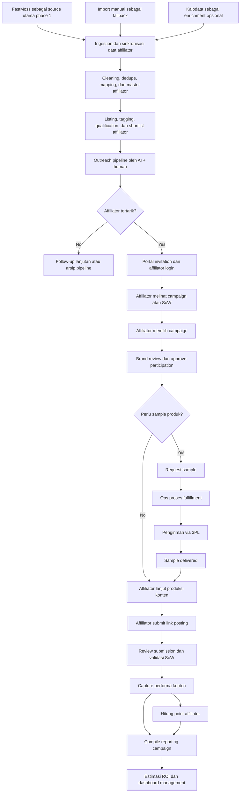

# BRD - Affiliate Dashboard (Adiboga)

## 1. Ringkasan Eksekutif

Affiliate Dashboard (Adiboga) adalah sistem end-to-end untuk mengelola proses affiliate marketing dari tahap sourcing affiliator sampai reporting performa campaign. Sistem ini dirancang agar brand dapat menjalankan workflow yang lebih terstruktur, terukur, dan scalable, tanpa bergantung penuh pada tracking manual di spreadsheet atau chat.

Flow bisnis utama yang saat ini sudah teridentifikasi:
1. Mencari affiliator sesuai spek dengan FastMoss sebagai source utama phase 1
2. Menyusun listing data affiliator
3. Melakukan approach ke affiliator dengan kombinasi AI dan human
4. Affiliator login ke portal
5. Affiliator memilih SoW / campaign yang ingin diikuti
6. Brand memproses pengiriman sample sesuai request affiliator melalui 3PL
7. Setelah produk diterima, affiliator membuat konten sesuai SoW
8. Affiliator submit/update link posting ke portal dan mendapatkan point
9. Sistem meng-compile reporting dan menghitung estimasi ROI otomatis

## 2. Latar Belakang

Proses affiliate marketing biasanya tersebar di banyak tools: sourcing di platform pihak ketiga, komunikasi via chat, tracking sample via spreadsheet, submission konten lewat form, dan reporting manual. Kondisi ini menimbulkan beberapa masalah:
- data affiliator tidak terpusat
- sulit memantau status approach dan follow-up
- sample shipment sulit ditrack end-to-end
- validasi pemenuhan SoW tidak konsisten
- reporting ROI lambat dan rawan bias asumsi

Affiliate Dashboard dibutuhkan untuk menyatukan semua tahapan tersebut dalam satu sistem operasional yang lebih rapi.

## 3. Tujuan Bisnis

### 3.1 Tujuan Utama
- Membuat pipeline affiliate marketing yang terstruktur dari sourcing sampai reporting
- Mengurangi kerja manual tim brand / marketing / ops
- Mempercepat proses aktivasi affiliator
- Meningkatkan visibilitas performa campaign dan kontribusi affiliator
- Menyediakan dasar pengambilan keputusan berbasis data

### 3.2 Outcome yang Diharapkan
- database affiliator terpusat dan bisa difilter
- status pipeline affiliator bisa dimonitor
- pengiriman sample terdokumentasi
- submit link konten lebih disiplin
- point/reward affiliator bisa dihitung sistematis
- reporting estimasi ROI lebih cepat tersedia

## 4. Ruang Lingkup

### 4.1 In Scope
1. **Affiliate sourcing management**
   - pengambilan data affiliator dari FastMoss sebagai source utama phase 1
   - support optional enrichment dari Kalodata pada fase berikutnya atau validasi manual
   - support import/manual upload sebagai fallback bila connector external gagal atau belum tersedia
   - tagging affiliator berdasarkan spek tertentu
   - shortlist affiliator

2. **Affiliate listing & master data**
   - profil affiliator
   - channel/platform utama
   - kategori konten
   - audience insight yang tersedia dari sumber data
   - histori campaign internal

3. **Approach workflow**
   - template outreach berbasis AI
   - assignment follow-up ke tim human
   - status approach pipeline
   - logging komunikasi internal

4. **Affiliate portal**
   - login affiliator
   - dashboard affiliator
   - list SoW / campaign aktif
   - pengajuan minat ikut campaign

5. **SoW / campaign participation**
   - affiliator pilih campaign/SoW
   - brand review / approve
   - campaign terms dan deliverable tampil jelas

6. **Sample fulfillment**
   - request sample oleh affiliator
   - approval internal
   - proses pengiriman via 3PL
   - tracking delivery status

7. **Content submission**
   - affiliator input/update link posting
   - submit caption / tanggal tayang / platform
   - validasi status submission

8. **Point & reward logic**
   - point diberikan berdasarkan submission / rule tertentu
   - histori point affiliator

9. **Reporting & ROI estimation**
   - performa per affiliator
   - performa per campaign
   - estimasi ROI berbasis CPM, cost rate, dan estimasi NMV
   - export reporting

### 4.2 Out of Scope (Versi Awal)
- pembayaran komisi otomatis ke affiliator
- integrasi finance/accounting penuh
- integrasi resmi ke semua marketplace/social platform
- advanced fraud detection berbasis machine learning
- attribution model multi-touch yang kompleks

## 5. Stakeholder

### 5.1 Internal
- Brand / Marketing Team
- Affiliate Manager
- CRM / Outreach Team
- Operations / Fulfillment Team
- Management / Decision Maker
- Admin Sistem

### 5.2 External
- Affiliator / Creator
- 3PL / Logistics Partner
- Data provider seperti FastMoss dan Kalodata

## 6. Aktor Sistem

1. **Admin**
   - mengelola master data, user, rule, dan akses

2. **Affiliate Manager**
   - mengelola shortlist affiliator, campaign, approval, monitoring performa

3. **Outreach / CRM Team**
   - melakukan pendekatan, follow-up, dan update pipeline komunikasi

4. **Ops / Fulfillment Team**
   - memproses request sample dan tracking pengiriman

5. **Affiliator**
   - login portal, pilih campaign, request sample, submit link konten

6. **Management**
   - melihat dashboard dan reporting eksekutif

## 7. Analisa Flow Bisnis

### 7.1 Flow Besar yang Sudah Diberikan
- Cari affiliator sesuai spek dari source utama FastMoss
- Listing data affiliate
- Affiliator di-approach dengan AI + human
- Affiliator login portal
- Affiliator pilih SoW yang ingin diikuti
- Brand kirim sample via 3PL
- Affiliator buat konten sesuai SoW
- Affiliator update link posting dan dapat point
- Sistem compile reporting dan estimasi ROI

### 7.2 Analisa Operasional
Flow di atas sudah kuat sebagai high-level process, tetapi secara sistem masih perlu pemecahan ke modul dan keputusan operasional yang lebih detail.

#### A. Sourcing
Yang perlu dijelaskan lebih lanjut:
- spek affiliator ditentukan berdasarkan apa saja? (follower, niche, engagement, lokasi, platform, audience fit)
- data dari FastMoss diambil melalui API atau connector lain yang disepakati
- import manual tetap tersedia sebagai fallback operasional
- Kalodata dapat digunakan sebagai enrichment / pembanding bila dibutuhkan
- apakah satu affiliator bisa punya multi-account?

#### B. Listing & Qualification
Perlu ada status yang jelas, misalnya:
- new lead
- shortlisted
- contacted
- interested
- approved
- active
- inactive
- blacklisted

#### C. Outreach
Flow "AI + human" perlu dipisah:
- AI untuk generate draft message / personalization
- human untuk review, kirim, dan follow-up

Sistem sebaiknya tidak mengasumsikan AI mengirim otomatis tanpa approval, kecuali nanti memang disetujui secara bisnis.

#### D. Portal Affiliator
Perlu ditentukan apakah affiliator:
- hanya bisa melihat campaign yang diundang
- atau bisa browse semua campaign terbuka

#### E. SoW / Campaign
Perlu didefinisikan lebih rinci:
- deliverable per campaign
- tenggat waktu
- kuota affiliator
- kategori produk
- syarat sample
- aturan point

#### F. Sample Fulfillment
Ini salah satu titik operasional paling sensitif.
Perlu ada status:
- sample requested
- approved
- prepared
- shipped
- delivered
- failed / returned

Juga perlu jelas apakah 3PL diinput manual atau melalui integrasi.

#### G. Content Submission
Perlu ada validasi:
- link valid atau tidak
- platform posting
- tanggal tayang
- status review
- apakah content sesuai SoW

#### H. Point & Reward
Perlu definisi rule yang jelas:
- point berdasarkan submit link?
- berdasarkan content approved?
- berdasarkan performa?
- apakah ada multiplier untuk campaign tertentu?

#### I. Reporting & ROI
Bagian ini secara bisnis sangat penting, tapi juga paling rawan salah tafsir bila input datanya tidak standar.

Asumsi awal dari user:
- ROI dihitung dari CPM
- cost rate
- estimasi NMV

Artinya sistem kemungkinan belum memiliki real closed-loop sales attribution penuh. Maka penting membedakan:
- **actual performance data**
- **estimated performance / estimated ROI**

Ini harus ditulis eksplisit agar manajemen tidak menganggap semua angka sebagai angka final akuntansi.

## 8. Kebutuhan Fungsional

### 8.1 Modul Sourcing Affiliator
- sistem dapat mengambil dan menyimpan data affiliator dari FastMoss sebagai source utama phase 1
- sistem mendukung import data affiliator sebagai fallback
- sistem dapat menandai asal source data untuk tiap record
- sistem mendukung tagging dan filtering affiliator
- sistem mendukung shortlist affiliator

### 8.2 Modul Affiliate Master Listing
- sistem menyimpan profil affiliator
- sistem menyimpan atribut seperti platform, niche, lokasi, follower, engagement, notes
- sistem menampilkan histori status affiliator
- sistem dapat memetakan satu affiliator ke lebih dari satu akun/platform bila diperlukan

### 8.3 Modul Outreach Pipeline
- sistem mendukung pembuatan outreach task
- sistem menyediakan draft outreach message berbasis AI
- sistem mencatat hasil approach dan follow-up
- sistem memiliki status pipeline approach

### 8.4 Modul Campaign / SoW
- admin/manager dapat membuat campaign / SoW
- campaign memiliki deliverable, timeline, requirement, point rule, quota
- affiliator dapat melihat dan memilih campaign tertentu
- manager dapat approve / reject partisipasi affiliator

### 8.5 Modul Portal Affiliator
- affiliator dapat login
- affiliator dapat melihat profil, campaign tersedia, histori partisipasi, point
- affiliator dapat mengajukan request sample
- affiliator dapat submit/update link posting

### 8.6 Modul Sample Fulfillment
- tim internal dapat melihat request sample
- sistem mencatat approval sample
- sistem mencatat nomor resi / tracking
- sistem menampilkan status pengiriman

### 8.7 Modul Content Submission
- affiliator dapat input link posting
- affiliator dapat update link bila diperlukan
- tim internal dapat review submission
- sistem menyimpan metadata submission

### 8.8 Modul Point System
- sistem dapat menghitung point berdasarkan rule
- sistem menyimpan ledger point affiliator
- sistem menampilkan histori point

### 8.9 Modul Reporting
- sistem menampilkan dashboard per campaign
- sistem menampilkan dashboard per affiliator
- sistem menampilkan status pipeline affiliate
- sistem menghitung estimasi ROI
- sistem mendukung export report

## 9. Kebutuhan Non-Fungsional

- role-based access control
- audit trail untuk perubahan status penting
- export data ke CSV/Excel
- dashboard cukup responsif untuk desktop operations
- struktur data siap dikembangkan ke integrasi API di masa depan
- sistem harus bisa menangani data affiliator dalam volume menengah-besar
- sistem harus bisa membedakan external source data dan master affiliator internal

## 10. User Stories

1. Sebagai Affiliate Manager, saya ingin mengambil data affiliator dari FastMoss agar tim bisa mulai melakukan shortlist lebih cepat.
2. Sebagai Affiliate Manager, saya ingin tetap bisa import data affiliator secara manual agar operasional tetap berjalan jika connector external bermasalah.
3. Sebagai Outreach Team, saya ingin melihat status approach tiap affiliator agar follow-up tidak tercecer.
4. Sebagai Outreach Team, saya ingin mendapatkan draft pesan dari AI agar personalisasi outreach lebih cepat.
5. Sebagai Affiliator, saya ingin login ke portal agar bisa melihat campaign yang tersedia.
6. Sebagai Affiliator, saya ingin memilih SoW yang ingin saya ikuti agar bisa mengikuti campaign yang relevan.
7. Sebagai Ops Team, saya ingin melihat request sample agar bisa memproses pengiriman tepat waktu.
8. Sebagai Ops Team, saya ingin menginput tracking 3PL agar status kiriman bisa dipantau.
9. Sebagai Affiliator, saya ingin submit link posting agar submission saya tercatat dan bisa dinilai.
10. Sebagai Sistem, saya ingin menghitung point affiliator berdasarkan rule campaign agar reward logic konsisten.
11. Sebagai Management, saya ingin melihat estimasi ROI per campaign agar bisa menilai efektivitas program affiliate.

## 11. KPI dan Success Metrics

### 11.1 KPI Operasional
- jumlah affiliator sourced per periode
- conversion rate dari sourced ke contacted
- conversion rate dari contacted ke activated
- turnaround time dari interest ke sample shipped
- turnaround time dari sample delivered ke content submitted

### 11.2 KPI Campaign
- jumlah affiliator aktif per campaign
- jumlah submission per campaign
- on-time submission rate
- total point issued

### 11.3 KPI Bisnis
- estimated reach / impression
- estimated media value
- estimated NMV
- estimated ROI
- cost per activated affiliator

## 12. Risiko dan Catatan Penting

### 12.1 Risiko Data
- data FastMoss atau source external lain mungkin tidak selalu lengkap
- kemungkinan duplikasi affiliator
- kemungkinan multi-account creator
- field dari source external bisa berubah sewaktu-waktu

### 12.2 Risiko Operasional
- affiliator tidak responsif setelah diapproach
- sample terkirim tetapi content tidak dibuat
- link submission valid tetapi kualitas content tidak sesuai SoW

### 12.3 Risiko Analitik
- ROI yang dihitung kemungkinan bersifat estimasi, bukan actual booked revenue
- jika asumsi CPM / cost rate / estimasi NMV tidak distandarkan, reporting bisa bias

### 12.4 Risiko Integrasi
- auth, rate limit, atau perubahan struktur source external dapat mengganggu ingestion
- Kalodata mungkin belum tersedia sebagai connector di phase awal
- fase awal mungkin tetap butuh semi-manual workflow pada beberapa titik

## 13. Asumsi Awal

1. Data affiliator phase 1 berasal terutama dari FastMoss
2. Sistem tetap mendukung import/manual upload sebagai fallback
3. Kalodata dapat digunakan sebagai enrichment atau research support, bukan source utama phase 1
4. Approach dilakukan oleh tim internal dengan bantuan AI untuk draft/personalization
5. Affiliator memiliki akun portal sendiri
6. Sample fulfillment dapat dijalankan semi-manual lebih dulu dengan input resi manual
7. ROI pada fase awal adalah **estimasi ROI**, bukan full audited ROI

## 14. Rekomendasi Struktur Modul Sistem

1. **Lead Sourcing Module**
2. **Affiliate CRM / Pipeline Module**
3. **Campaign & SoW Module**
4. **Affiliate Portal Module**
5. **Sample Fulfillment Module**
6. **Content Submission Module**
7. **Point & Reward Module**
8. **Analytics & Reporting Module**

## 15. Struktur Model Sistem untuk Stakeholder

Bagian ini dibuat agar stakeholder non-teknis bisa memahami bentuk sistem secara utuh sebelum masuk ke flow detail, PRD, atau desain UI.

### 15.1 Gambaran Besar
Secara sederhana, sistem Affiliate Dashboard (Adiboga) dibagi menjadi 6 lapisan kerja:

1. **Lapisan Sumber Data**
   Sistem mengambil data awal affiliator dari FastMoss sebagai source utama. Jika dibutuhkan, data bisa diperkaya dari Kalodata atau dimasukkan lewat import manual sebagai fallback.

2. **Lapisan Master Data Affiliator**
   Semua data affiliator yang sudah lolos proses mapping dan dedupe akan disimpan sebagai master data internal. Ini penting supaya tim tidak bekerja langsung di atas data mentah dari source luar.

3. **Lapisan Outreach dan Relationship Management**
   Setelah affiliator masuk shortlist, tim bisa melakukan approach, follow-up, dan mencatat hasil komunikasi. AI membantu drafting pesan, tetapi keputusan dan eksekusi tetap dipegang human.

4. **Lapisan Campaign dan Portal Affiliator**
   Di lapisan ini brand membuat campaign atau SoW, lalu affiliator yang terundang atau eligible bisa login ke portal, melihat campaign, dan memilih partisipasi.

5. **Lapisan Operasional Fulfillment dan Submission**
   Setelah affiliator join campaign, proses request sample, pengiriman via 3PL, dan submit link konten dikelola di lapisan ini.

6. **Lapisan Point, Performance, dan Reporting**
   Setelah konten terkirim, sistem mengumpulkan performa, menghitung point, dan menyusun reporting termasuk estimasi ROI.

### 15.2 Cara Stakeholder Melihat Sistem
Agar lebih mudah dipahami, sistem ini bisa dibayangkan seperti rantai proses berikut:

- **Source masuk**
  FastMoss, Kalodata, atau import manual memberikan data awal affiliator.

- **Data dibersihkan dan disusun**
  Sistem memilih, merapikan, dan menyatukan data agar menjadi master affiliator yang bisa dipakai tim internal.

- **Tim mulai approach**
  Tim outreach menggunakan data tersebut untuk pendekatan, dibantu AI untuk drafting pesan.

- **Affiliator masuk ke campaign**
  Affiliator yang tertarik bisa login ke portal dan memilih campaign yang ingin diikuti.

- **Operasional campaign berjalan**
  Sample dikirim, konten dibuat, link posting dikumpulkan.

- **Hasil diukur**
  Sistem menghitung point, performa, dan estimasi hasil bisnis.

### 15.3 Modul Sistem yang Dilihat dari Sudut Pandang Bisnis
Berikut struktur sistem jika dijelaskan dalam bahasa bisnis:

#### A. Modul Sourcing Affiliator
Fungsi:
- mengambil data affiliator dari source luar
- mendukung pencarian affiliator sesuai spek
- menjadi pintu masuk calon affiliator baru

Output utama:
- daftar calon affiliator yang relevan

#### B. Modul Master Listing dan Qualification
Fungsi:
- menyimpan affiliator yang sudah lolos seleksi awal
- memberi tag, status, dan segmentasi
- menjaga agar data affiliator rapi dan tidak duplikat

Output utama:
- database affiliator internal yang siap dipakai tim

#### C. Modul Outreach dan CRM Affiliate
Fungsi:
- mencatat proses pendekatan
- melacak status follow-up
- membantu tim membangun relationship dengan affiliator

Output utama:
- pipeline affiliator dari belum dihubungi sampai aktif join campaign

#### D. Modul Campaign / SoW Management
Fungsi:
- membuat campaign
- mengatur deliverable, requirement, kuota, dan rule point
- menjadi pusat pengaturan program affiliate

Output utama:
- campaign yang siap dijalankan dan dipilih affiliator

#### E. Modul Portal Affiliator
Fungsi:
- menjadi tempat affiliator login
- melihat campaign yang tersedia
- mengajukan partisipasi
- submit progress dan link konten

Output utama:
- interaksi affiliator dengan brand yang lebih terstruktur

#### F. Modul Sample Fulfillment
Fungsi:
- memproses request sample
- melacak pengiriman
- menghubungkan campaign dengan operasional 3PL

Output utama:
- status sample dari request sampai delivered

#### G. Modul Submission dan Performance
Fungsi:
- menyimpan link konten
- review kesesuaian konten dengan SoW
- mengumpulkan performa konten

Output utama:
- data performa per affiliator dan per campaign

#### H. Modul Point dan Reporting
Fungsi:
- menghitung point affiliator
- menyusun dashboard performa
- menyusun estimasi ROI

Output utama:
- laporan performa dan insight pengambilan keputusan

### 15.4 Nilai Strategis Tiap Lapisan
Jika dilihat dari sudut pandang manajemen, tiap lapisan punya fungsi strategis berbeda:

- **Sourcing Layer**
  Menjawab pertanyaan: kita mau cari affiliator dari mana?

- **Master Data Layer**
  Menjawab pertanyaan: siapa affiliator yang benar-benar menjadi aset data internal kita?

- **Outreach Layer**
  Menjawab pertanyaan: siapa yang sudah dihubungi, tertarik, atau siap diaktifkan?

- **Campaign Layer**
  Menjawab pertanyaan: program apa yang sedang ditawarkan ke affiliator?

- **Fulfillment & Submission Layer**
  Menjawab pertanyaan: apakah campaign berjalan sesuai rencana secara operasional?

- **Reporting Layer**
  Menjawab pertanyaan: campaign ini menghasilkan value atau tidak?

### 15.5 Prinsip Penting dalam Struktur Model Sistem
Ada beberapa prinsip yang perlu dipahami stakeholder sejak awal:

1. **Data source external tidak sama dengan master data internal**
   Data dari FastMoss atau Kalodata belum otomatis menjadi data final. Data itu masih perlu dipilih, dicocokkan, dan dirapikan.

2. **Sistem ini bukan hanya dashboard reporting**
   Sistem ini adalah mesin operasional dari sourcing sampai reporting.

3. **Import manual tetap dipertahankan untuk keamanan operasional**
   Walaupun FastMoss menjadi source utama phase 1, fallback tetap penting jika connector bermasalah.

4. **ROI awal bersifat estimasi**
   Dashboard tidak boleh langsung dianggap sebagai laporan keuangan final tanpa fondasi atribusi yang kuat.

### 15.6 Kesimpulan untuk Stakeholder
Jika dijelaskan secara sederhana, Affiliate Dashboard (Adiboga) adalah sistem yang mengubah proses affiliate marketing dari kerja manual yang tersebar menjadi alur kerja terpadu:

- cari affiliator
- pilih affiliator yang cocok
- approach affiliator
- jalankan campaign
- kirim sample
- kumpulkan hasil konten
- hitung performa dan estimasi hasil bisnis

Dengan struktur ini, stakeholder bisa melihat bahwa sistem bukan hanya alat tracking, tetapi fondasi operasional affiliate management end-to-end.

## 16. Mermaid Flow Global

Bagian ini menunjukkan alur global sistem Affiliate Dashboard (Adiboga) dari source data sampai reporting. Diagram ini ditujukan untuk membantu stakeholder memahami hubungan antar modul utama secara visual.

### Penjelasan Singkat Flow

1. Data affiliator masuk dari FastMoss sebagai jalur utama. Import manual tetap tersedia sebagai fallback, dan Kalodata dapat dipakai sebagai enrichment.
2. Data mentah tidak langsung dipakai. Sistem harus melakukan cleaning, dedupe, mapping, lalu membentuk master affiliator internal.
3. Setelah itu tim melakukan listing, qualification, dan outreach dengan kombinasi AI dan human.
4. Affiliator yang tertarik akan masuk ke portal, memilih campaign, lalu menunggu approval.
5. Bila campaign membutuhkan sample, proses fulfillment dan 3PL akan berjalan sebelum affiliator membuat konten.
6. Setelah konten diposting, affiliator submit link, tim review submission, lalu sistem menangkap performa konten.
7. Dari performa tersebut sistem menghitung point, menyusun reporting, dan menghasilkan estimasi ROI.
## 17. Prioritas MVP yang Disarankan

### Phase 1
- FastMoss connector / source ingestion
- import affiliator sebagai fallback
- affiliate listing
- outreach pipeline
- campaign / SoW setup
- portal login basic

### Phase 2
- request sample
- shipment tracking
- content submission
- approval workflow
- optional Kalodata enrichment

### Phase 3
- point engine
- ROI estimation dashboard
- AI-assisted outreach enhancement
- executive reporting
- multi-source scoring and enrichment

## 18. Keputusan Penting Sebelum Masuk Desain Sistem

Sebelum lanjut ke PRD / wireframe / arsitektur teknis, ada beberapa hal yang perlu difinalkan:
1. definisi field data affiliator minimum dari FastMoss dan fallback import
2. status pipeline resmi affiliator
3. rule point resmi
4. definisi SoW/campaign structure
5. rumus estimasi ROI yang disepakati
6. metode ingestion source external yang disetujui untuk phase awal

## 19. Kesimpulan

Secara bisnis, flow yang diberikan sudah cukup solid untuk dijadikan fondasi sistem. Nilai utama Affiliate Dashboard ini ada pada kemampuannya menghubungkan proses yang biasanya tercecer menjadi satu operational pipeline yang bisa dipantau ujung ke ujung.

Titik paling penting yang harus dijaga sejak awal:
- standardisasi status
- kualitas data affiliator
- pemisahan data source external dan master data internal
- disiplin tracking sample dan submission
- kejelasan bahwa ROI awal adalah estimasi

Jika fondasi ini rapi, sistem bisa berkembang dari sekadar dashboard operasional menjadi mesin affiliate ops yang scalable.

