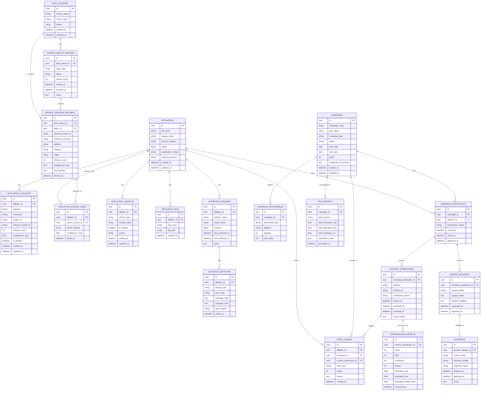

# Data Model - Affiliate Dashboard (Adiboga)

## Tujuan
Dokumen ini menjelaskan data model general untuk Affiliate Dashboard (Adiboga) berdasarkan scope saat ini.

Fokus data model:
- memisahkan source data external dengan data operasional internal
- mendukung sourcing dari FastMoss sebagai source utama phase 1
- tetap mendukung import/manual upload sebagai fallback
- menyiapkan fondasi untuk outreach, campaign, sample, submission, point, dan reporting

## Prinsip Desain
1. Data source external dan data internal dipisah sejak awal
2. Satu affiliator bisa memiliki lebih dari satu akun / channel
3. Satu affiliator bisa mengikuti banyak campaign
4. Shipment, content submission, dan point harus bisa diaudit
5. Reporting disusun dari data operasional + data performa + formula estimasi

## Mermaid ERD

## Penjelasan Entitas Utama

### 1. Data Source Layer
Entitas:
- `DATA_SOURCES`
- `SOURCE_IMPORT_BATCHES`
- `SOURCE_CREATOR_RECORDS`

Tujuan:
- menyimpan asal data seperti FastMoss, Kalodata, atau import manual
- memisahkan raw external data dari master affiliator internal
- memudahkan re-sync, audit, dan troubleshooting konektor

### 2. Master Affiliator Layer
Entitas:
- `AFFILIATORS`
- `AFFILIATOR_ACCOUNTS`
- `AFFILIATOR_CONTACTS`
- `AFFILIATOR_TAGS`
- `AFFILIATOR_SOURCE_LINKS`

Tujuan:
- membangun identitas affiliator internal yang lebih stabil
- mendukung satu affiliator dengan banyak akun/platform
- mendukung dedupe dan enrichment lintas source

### 3. Outreach Layer
Entitas:
- `OUTREACH_PIPELINES`
- `OUTREACH_ACTIVITIES`

Tujuan:
- melacak status pendekatan ke affiliator
- memisahkan draft AI, aktivitas human, dan hasil follow-up

### 4. Campaign Layer
Entitas:
- `CAMPAIGNS`
- `CAMPAIGN_DELIVERABLES`
- `CAMPAIGN_PARTICIPANTS`

Tujuan:
- menyimpan struktur campaign / SoW
- mencatat siapa ikut campaign apa dan status partisipasinya

### 5. Fulfillment Layer
Entitas:
- `SAMPLE_REQUESTS`
- `SHIPMENTS`

Tujuan:
- mencatat request sample dan pengiriman via 3PL
- mendukung tracking status operasional

### 6. Submission & Performance Layer
Entitas:
- `CONTENT_SUBMISSIONS`
- `PERFORMANCE_METRICS`

Tujuan:
- menyimpan link posting dan hasil review
- mencatat performa konten untuk kebutuhan estimasi value dan ROI

### 7. Point & Reporting Layer
Entitas:
- `POINT_LEDGER`
- `ROI_REPORTS`

Tujuan:
- menghitung reward affiliator secara audit-friendly
- menyimpan ringkasan reporting per campaign/periode

## Catatan Penting

1. FastMoss diposisikan sebagai source utama phase 1, tetapi model tetap support Kalodata dan import manual.
2. Contact data sebaiknya tidak diasumsikan selalu datang dari source external. Bisa jadi harus diisi atau diverifikasi internal.
3. `SOURCE_CREATOR_RECORDS` tidak langsung dianggap master affiliator. Harus lewat proses mapping/dedupe ke `AFFILIATORS`.
4. `ROI_REPORTS` harus dianggap estimasi kecuali di masa depan sudah ada actual commerce attribution yang valid.
5. Jika nanti ada portal affiliator yang lebih kompleks, bisa ditambah entitas auth/user terpisah.
