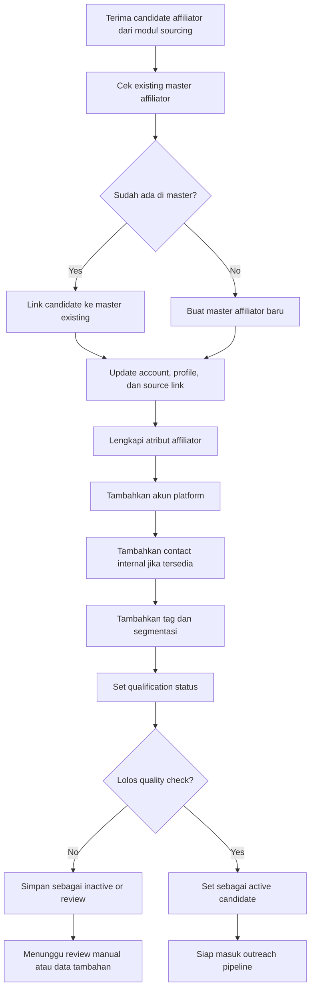

# 02 - Master Affiliator Flow

## Tujuan
Flow ini menjelaskan bagaimana kandidat affiliator hasil sourcing diubah menjadi master affiliator internal yang rapi, tidak duplikat, dan siap dipakai oleh tim untuk qualification, outreach, dan campaign management.

## Fokus Flow
Modul ini mencakup:
- menerima kandidat dari sourcing
- cek duplikasi dan mapping akun
- pembentukan master affiliator internal
- pengelolaan akun, contact, tag, dan status
- qualification untuk menentukan apakah affiliator layak masuk pipeline aktif

## Mermaid Flow

## Penjelasan Langkah

### 1. Candidate masuk dari sourcing
Candidate dari FastMoss atau import manual belum otomatis menjadi aset data internal. Candidate masih harus diverifikasi dan dipetakan.

### 2. Cek existing master affiliator
Sistem memeriksa apakah affiliator ini sebenarnya sudah ada di database master.

Pemeriksaan dapat memakai:
- external creator id
- username
- profile URL
- kombinasi nama dan akun

### 3. Link atau create
Jika affiliator sudah ada:
- candidate di-link ke master existing
- data baru dipakai untuk update atau enrichment

Jika affiliator belum ada:
- sistem membuat master affiliator baru

### 4. Lengkapi atribut affiliator
Master affiliator perlu punya struktur yang lebih rapi dari data source mentah.

Contoh atribut:
- nama display
- platform utama
- niche / kategori
- follower dan engagement signal
- region / market focus
- status affiliator

### 5. Tambahkan akun dan contact
Satu affiliator bisa punya lebih dari satu akun/platform, jadi account mapping perlu dipisah dari entity master.

Contact internal juga bisa ditambahkan bila tim sudah punya:
- nomor WA
- email
- contact person
- notes relasi

### 6. Tagging dan segmentasi
Tag membantu tim mengelompokkan affiliator berdasarkan:
- kategori produk
- niche creator
- tier follower
- region
- campaign fit
- status hubungan

### 7. Qualification status
Setelah data cukup rapi, affiliator diberi qualification status.

Contoh status:
- new
- reviewed
- qualified
- need review
- inactive
- blacklisted

### 8. Quality check
Tidak semua affiliator harus langsung aktif masuk pipeline. Bila data kurang lengkap atau tidak relevan, affiliator bisa ditahan dulu untuk review.

## Decision Points Penting

### A. Identity resolution
Apakah candidate ini benar-benar orang yang sama dengan record existing?

### B. Data completeness
Apakah atribut minimum cukup untuk dijadikan master yang usable?

### C. Qualification threshold
Apakah affiliator cukup relevan untuk dijadikan kandidat aktif?

## Output Modul
Output utama dari modul ini:
- master affiliator records
- affiliator accounts
- affiliator contacts
- tags dan segmentasi
- qualification status
- daftar affiliator yang siap masuk outreach

## Catatan untuk Stakeholder
Modul ini adalah jembatan antara data mentah dan data operasional. Tanpa modul ini, tim akan bekerja di data yang duplikat, tidak konsisten, dan sulit dipakai untuk decision making.
