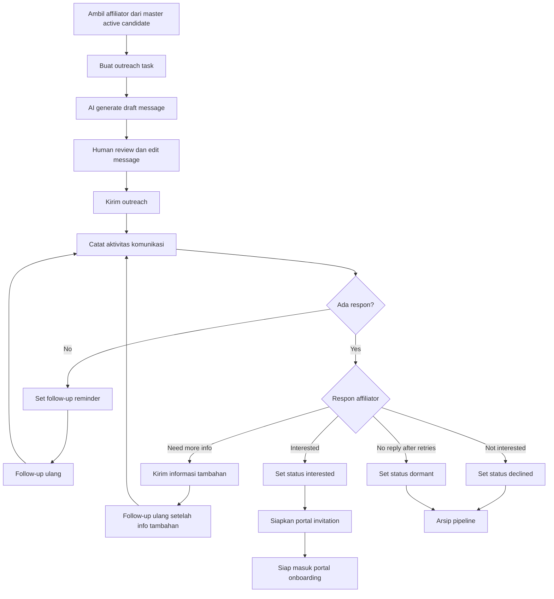

# 03 - Outreach Flow

## Tujuan
Flow ini menjelaskan bagaimana tim melakukan approach ke affiliator menggunakan kombinasi AI dan human sampai affiliator dinyatakan tertarik, tidak tertarik, atau perlu follow-up lanjutan.

## Fokus Flow
- memilih affiliator siap outreach
- generate draft pesan dengan AI
- review dan kirim oleh human
- follow-up pipeline
- pencatatan hasil komunikasi
- keputusan lanjut ke portal atau berhenti

## Mermaid Flow

## Penjelasan Langkah

### 1. Pilih affiliator siap outreach
Hanya affiliator yang sudah lolos qualification yang masuk ke modul ini.

### 2. AI generate draft
AI dipakai untuk mempercepat personalisasi pesan berdasarkan:
- niche affiliator
- kategori produk
- campaign fit
- tone outreach yang diinginkan

### 3. Human review
Tim tetap memegang kontrol akhir. Pesan tidak boleh dikirim otomatis tanpa approval.

### 4. Kirim outreach
Channel bisa berbeda-beda:
- DM
- WhatsApp
- email
- contact form

### 5. Catat aktivitas
Setiap outreach perlu dicatat agar tim tahu:
- kapan dikirim
- lewat channel apa
- hasilnya bagaimana
- siapa PIC-nya

### 6. Handle response
Kemungkinan response utama:
- tertarik
- minta info tambahan
- tidak tertarik
- tidak merespons

### 7. Follow-up loop
Jika belum ada kepastian, sistem harus bantu follow-up terstruktur, bukan bergantung ke ingatan manual tim.

### 8. Siap ke portal
Jika affiliator tertarik, langkah berikutnya adalah mengundang ke portal dan menghubungkan ke campaign yang relevan.

## Decision Points Penting

### A. Approval sebelum kirim
AI membantu draft, tapi human tetap approve.

### B. Retry policy
Berapa kali follow-up dilakukan sebelum status dianggap dormant?

### C. Interested threshold
Apakah affiliator cukup tertarik untuk langsung diundang ke portal, atau masih perlu screening manual?

## Output Modul
- outreach tasks
- communication logs
- pipeline status per affiliator
- daftar affiliator interested
- daftar affiliator declined/dormant

## Catatan untuk Stakeholder
Nilai modul outreach bukan cuma mengirim pesan, tapi menciptakan proses relationship management yang terukur. Ini yang membedakan sistem dari sekadar spreadsheet contact list.
