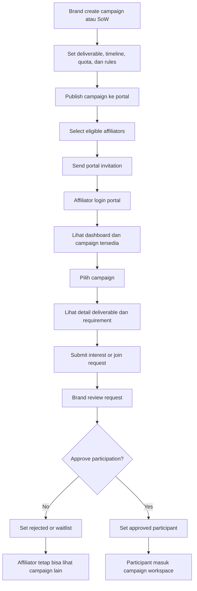

# 04 - Campaign and Portal Flow

## Tujuan
Flow ini menjelaskan bagaimana brand membuat campaign/SoW, mengundang affiliator, lalu bagaimana affiliator login ke portal dan memilih campaign yang ingin diikuti.

## Fokus Flow
- setup campaign dan SoW
- invite atau expose campaign ke affiliator
- affiliator login portal
- review campaign detail
- pilih campaign
- approval participation

## Mermaid Flow

## Penjelasan Langkah

### 1. Campaign setup
Brand membuat campaign dengan elemen utama:
- nama campaign
- SoW
- deliverable
- timeline
- quota
- point rule
- requirement

### 2. Publish campaign
Campaign harus tersedia dalam bentuk yang bisa dibaca affiliator secara jelas.

### 3. Select eligible affiliators
Tidak semua affiliator harus melihat campaign yang sama. Bisa ada filtering berdasarkan:
- niche
- region
- follower tier
- histori performa

### 4. Portal invitation
Affiliator yang eligible diundang ke portal untuk melihat campaign.

### 5. Portal login
Portal menjadi titik interaksi resmi antara brand dan affiliator.

### 6. Review detail
Affiliator harus bisa membaca:
- apa deliverable-nya
- kapan deadline-nya
- apa benefit-nya
- apa syarat sample atau konten

### 7. Submit join request
Affiliator mengajukan minat ikut campaign melalui portal, bukan lewat chat manual.

### 8. Brand approval
Brand memutuskan apakah affiliator:
- approved
- rejected
- waitlisted

### 9. Approved participant
Jika approved, affiliator masuk ke ruang kerja campaign dan siap ke tahap operasional berikutnya.

## Decision Points Penting

### A. Campaign visibility
Apakah campaign visible untuk semua affiliator eligible atau undangan terbatas?

### B. Approval logic
Apakah semua join request perlu approval manual atau ada auto-approval untuk kondisi tertentu?

### C. Quota management
Apa yang terjadi jika quota sudah penuh?

## Output Modul
- campaign records
- eligible affiliator lists
- portal invitations
- join requests
- approved or rejected participants

## Catatan untuk Stakeholder
Modul ini adalah jantung program affiliate. Di sinilah brand mengubah daftar affiliator menjadi partisipan campaign yang nyata.
