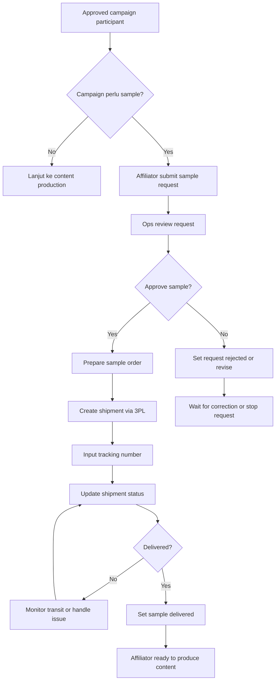

# 05 - Sample Fulfillment Flow

## Tujuan
Flow ini menjelaskan bagaimana request sample diproses setelah affiliator diterima di campaign, termasuk approval internal, pengiriman via 3PL, dan status sampai sample diterima.

## Fokus Flow
- request sample
- approval internal
- preparation
- shipment via 3PL
- tracking delivery
- handoff ke tahap content production

## Mermaid Flow

## Penjelasan Langkah

### 1. Check sample requirement
Tidak semua campaign butuh sample. Kalau tidak perlu, affiliator bisa langsung lanjut produksi konten.

### 2. Submit sample request
Jika perlu sample, affiliator mengajukan request melalui portal.

### 3. Ops review
Tim ops memeriksa:
- apakah participant valid
- apakah alamat lengkap
- apakah sample available
- apakah request sesuai rule campaign

### 4. Approval
Request bisa:
- approved
- rejected
- dikembalikan untuk revisi

### 5. Prepare shipment
Jika approved, tim menyiapkan sample dan pengiriman.

### 6. 3PL shipment
Shipment dibuat via partner logistik, lalu nomor resi dicatat ke sistem.

### 7. Tracking
Status shipment dipantau sampai delivered.

### 8. Delivered handoff
Setelah sample diterima, affiliator resmi masuk ke tahap produksi konten.

## Decision Points Penting

### A. Eligibility
Apakah participant ini berhak menerima sample?

### B. Address quality
Apakah alamat pengiriman valid dan cukup lengkap?

### C. Exception handling
Apa proses jika shipment gagal, tertunda, atau returned?

## Output Modul
- sample request records
- approval status
- shipment records
- tracking number
- delivery confirmation

## Catatan untuk Stakeholder
Modul ini memastikan campaign tidak berhenti di approval saja. Sample fulfillment adalah jembatan penting antara keputusan brand dan eksekusi konten oleh affiliator.
