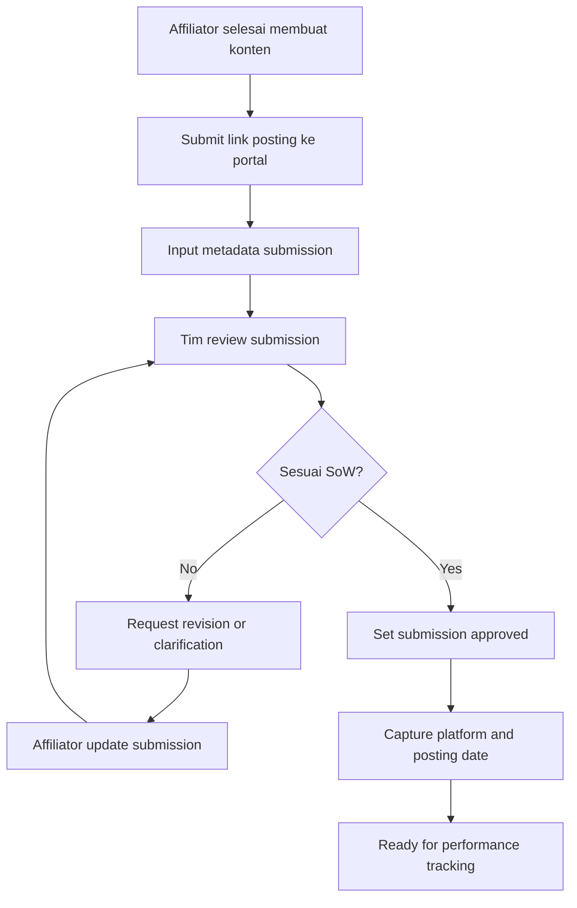

# 06 - Content Submission Flow

## Tujuan
Flow ini menjelaskan bagaimana affiliator mengirim link konten ke portal, bagaimana tim mereview kesesuaiannya dengan SoW, dan bagaimana submission dinyatakan valid.

## Fokus Flow
- produksi konten oleh affiliator
- submit link posting
- review kesesuaian SoW
- revisi bila perlu
- final valid submission

## Mermaid Flow

## Penjelasan Langkah

### 1. Affiliator produksi konten
Setelah sample diterima atau campaign aktif, affiliator membuat konten sesuai requirement.

### 2. Submit link ke portal
Submission dilakukan secara terstruktur melalui portal.

### 3. Metadata submission
Selain link, affiliator bisa diminta mengisi:
- platform
- caption
- tanggal tayang
- notes tambahan

### 4. Review internal
Tim review memastikan konten sesuai SoW.

Yang dicek misalnya:
- platform benar
- deliverable terpenuhi
- brand mention sesuai
- deadline dipenuhi

### 5. Revision loop
Jika belum sesuai, submission tidak langsung ditolak permanen. Tim bisa minta revisi atau klarifikasi.

### 6. Approved submission
Jika lolos review, submission ditandai approved dan siap ke tracking performa.

## Decision Points Penting

### A. Submission validity
Apakah link valid dan bisa diakses?

### B. SoW compliance
Apakah konten benar-benar memenuhi requirement campaign?

### C. Revision policy
Berapa kali revisi diperbolehkan sebelum ditutup?

## Output Modul
- content submission records
- review status
- revision requests
- approved submissions
- metadata posting untuk tracking

## Catatan untuk Stakeholder
Modul ini penting supaya sistem tidak hanya mengumpulkan link, tapi memastikan bahwa hasil campaign memang sesuai dengan brief yang disepakati.
