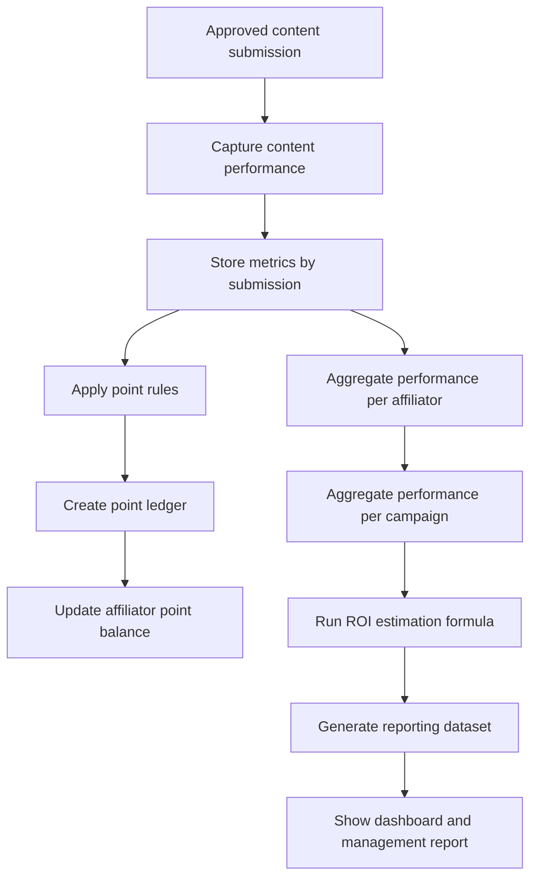

# 07 - Point and Reporting Flow

## Tujuan
Flow ini menjelaskan bagaimana submission yang sudah valid diubah menjadi point affiliator, data performa, dan reporting campaign termasuk estimasi ROI.

## Fokus Flow
- capture performa konten
- hitung point
- akumulasi performa affiliator
- compile reporting campaign
- estimasi ROI
- dashboard management

## Mermaid Flow

## Penjelasan Langkah

### 1. Capture performance
Setelah submission approved, sistem mulai mencatat performa konten.

Contoh metric:
- views
- likes
- comments
- shares
- engagement proxy

### 2. Store metrics
Metrics disimpan di level submission supaya setiap konten punya histori performa sendiri.

### 3. Apply point rules
Point diberikan sesuai rule campaign.

Kemungkinan rule:
- point untuk approved submission
- point tambahan untuk performa tertentu
- bonus untuk campaign spesial

### 4. Point ledger
Semua point harus masuk ledger agar audit-friendly dan transparan.

### 5. Aggregate reporting
Data performa diakumulasi ke beberapa level:
- per submission
- per affiliator
- per campaign

### 6. ROI estimation
Sistem menghitung estimasi ROI menggunakan formula yang disepakati, misalnya berbasis:
- CPM
- cost rate
- estimasi NMV

### 7. Dashboard output
Hasil akhirnya tampil ke dashboard untuk tim operasional dan manajemen.

## Decision Points Penting

### A. Point trigger
Kapan point dianggap sah? Saat submit, saat approved, atau setelah metric tertentu?

### B. Metric freshness
Seberapa sering performa di-refresh?

### C. ROI definition
Apa rumus estimasi ROI yang dipakai dan siapa yang menyetujuinya?

## Output Modul
- performance metrics
- point ledger
- affiliator point balance
- campaign performance summary
- estimated ROI report
- management dashboard

## Catatan untuk Stakeholder
Modul ini adalah titik di mana aktivitas affiliate diterjemahkan menjadi bahasa bisnis. Tanpa modul ini, manajemen hanya melihat aktivitas, bukan hasil.
