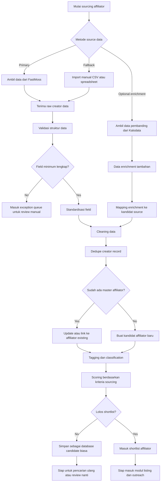

# 01 - Sourcing Flow

## Tujuan
Flow ini menjelaskan bagaimana sistem mendapatkan data affiliator dari source external, memprosesnya, lalu menyiapkannya menjadi kandidat affiliator yang siap masuk ke tahap listing, qualification, dan outreach.

Pada phase 1:
- **FastMoss** adalah source utama
- **Import manual** tetap tersedia sebagai fallback
- **Kalodata** dapat digunakan sebagai enrichment atau validasi tambahan bila dibutuhkan

## Fokus Flow
Modul ini mencakup:
- pengambilan data dari source
- fallback import manual
- enrichment optional
- cleaning dan standardisasi data
- dedupe dan mapping
- pembentukan master affiliator internal
- shortlist kandidat affiliator

## Mermaid Flow

## Penjelasan Langkah

### 1. Pemilihan source data
Sistem harus bisa menerima data dari beberapa jalur:
- FastMoss sebagai jalur utama phase 1
- import manual sebagai cadangan operasional
- Kalodata sebagai enrichment atau pembanding bila diperlukan

### 2. Raw data intake
Data dari source tidak langsung dipakai operasional. Semua data masuk terlebih dahulu sebagai raw source record.

Tujuannya:
- menjaga audit trail
- memudahkan troubleshooting source
- menghindari data mentah langsung mencemari master affiliator internal

### 3. Validasi struktur data
Sistem memeriksa apakah data minimum tersedia, misalnya:
- external creator id atau username
- platform
- kategori atau niche
- follower atau performance indicator dasar

Jika field minimum tidak cukup, data masuk ke **exception queue** untuk review manual.

### 4. Standardisasi dan cleaning
Setelah lolos validasi, sistem menormalkan data agar formatnya konsisten.

Contoh:
- format nama field diseragamkan
- angka follower dan engagement dibersihkan
- username/profile URL disesuaikan
- duplikasi format penulisan dikurangi

### 5. Enrichment optional
Jika Kalodata dipakai, datanya tidak menggantikan source utama, tetapi dipakai untuk:
- validasi tambahan
- insight pembanding
- memperkuat confidence terhadap kandidat affiliator tertentu

### 6. Dedupe dan mapping
Setelah data bersih, sistem harus menjawab:
- apakah ini affiliator baru?
- atau sebenarnya affiliator yang sudah ada tapi muncul lagi dari source berbeda?

Di tahap ini, sistem bisa:
- link ke affiliator existing
- atau membuat kandidat affiliator baru

Ini penting agar sistem tidak penuh duplikasi.

### 7. Tagging, classification, dan scoring
Setelah affiliator berhasil dipetakan, sistem memberi:
- tag
- kategori
- qualification status
- sourcing score

Contoh faktor scoring:
- niche relevance
- follower size
- engagement signal
- kecocokan dengan kategori produk
- potensi ikut campaign

### 8. Shortlist outcome
Hasil akhir sourcing dibagi dua:
- **candidate biasa** untuk arsip atau review lanjutan
- **shortlist affiliator** untuk langsung masuk tahap listing dan outreach

## Decision Points Penting

### A. Source availability
Jika FastMoss gagal atau tidak tersedia, tim masih bisa jalan lewat import manual.

### B. Minimum field completeness
Kalau field minimum tidak ada, data jangan dipaksa masuk master.

### C. Duplicate handling
Kalau creator sudah pernah ada, sistem harus update atau link, bukan create ulang tanpa kontrol.

### D. Shortlist qualification
Tidak semua affiliator hasil sourcing harus langsung diapproach. Perlu scoring dan filtering.

## Output Modul Sourcing
Output utama dari modul ini:
- raw source records
- candidate affiliator records
- linked master affiliator records
- shortlist affiliator
- exception queue untuk review manual

## Risiko Operasional

1. FastMoss API atau connector berubah
2. Data source tidak lengkap atau tidak konsisten
3. Duplikasi creator dari beberapa source
4. Kalodata enrichment tidak selalu tersedia
5. Manual import menghasilkan field yang tidak seragam

## Catatan untuk Stakeholder
Secara sederhana, modul sourcing adalah pintu masuk seluruh sistem. Kalau bagian ini kacau, maka listing, outreach, campaign assignment, dan reporting juga ikut kacau.

Karena itu, keputusan paling penting di modul ini adalah:
- source utama apa
- fallback apa
- data minimum apa
- cara dedupe bagaimana
- siapa yang berhak approve shortlist
